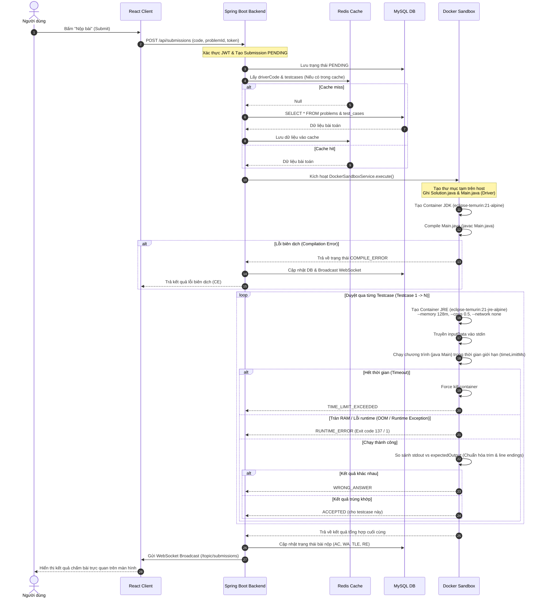

# UMDane Online Judge (UMDane OJ)

Nền tảng chấm bài trực tuyến thông minh (Online Judge) kiểu LeetCode, tích hợp Trí tuệ Nhân tạo (Gemini AI) tự động biên soạn đề bài và môi trường chấm điểm bảo mật (Docker Sandbox Engine).

---

## 🚀 Tính năng nổi bật

1. **Chấm bài kiểu LeetCode (Signature-style)**:
   - Người dùng chỉ cần cài đặt thuật toán trong lớp `Solution` có sẵn thay vì viết mã nguồn nhập/xuất tẻ nhạt.
   - Hệ thống tự sinh mã Wrapper (`driverCode` - `Main.java`) để đọc dữ liệu từ Test Case, gọi hàm người dùng và in kết quả.

2. **Sinh đề bài tự động bằng Gemini AI**:
   - Sử dụng Gemini 2.5 Flash API với cấu hình định dạng JSON Schema nghiêm ngặt.
   - Tự động thiết kế đề bài bằng tiếng Việt (tiêu đề, mô tả, gợi ý, ràng buộc dữ liệu constraints), bộ testcases (gồm cả testcases ẩn) và mã nguồn khung mẫu.

3. **Môi trường chạy code bảo mật (Docker Compiler Sandbox)**:
   - Cách ly hoàn toàn mã nguồn người dùng bằng các container siêu nhẹ Alpine JRE.
   - Tắt mạng hoàn toàn (`--network none`) để ngăn mã độc truy cập tài nguyên hoặc gọi API phá hoại.
   - Giới hạn phần cứng nghiêm ngặt (`--memory 128m`, `--cpus 0.5`) chống tấn công tràn ram, treo luồng (Fork Bomb).
   - Đo lường và báo lỗi chi tiết: **Accepted (AC)**, **Wrong Answer (WA)**, **Time Limit Exceeded (TLE)**, **Runtime Error (RE)**, **Compile Error (CE)**.

4. **Biểu đồ So sánh Hiệu năng kiểu LeetCode (LeetCode-style Analytics)**:
   - Phân tích và trực quan hóa phân phối thời gian chạy (Runtime) và bộ nhớ tiêu thụ (Space) của bài làm so với toàn bộ cộng đồng.
   - Tự động tính toán phần trăm vượt trội (Beats Percentile) bằng mô hình phân phối chuẩn Gaussian (phương sai tùy chỉnh) dựa trên dữ liệu trung bình và độ lệch chuẩn của các bài giải trong hệ thống.
   - Hiển thị trực quan qua hai biểu đồ vùng phủ (Area Chart) sắc nét, tự động tô màu highlight vị trí hiệu năng của người dùng.

5. **Thử thách Điền khuyết Code Hằng ngày (Daily Code Completion Challenge)**:
   - Áp dụng phương pháp Spaced Repetition (Lặp lại ngắt quãng) tự động quét các bài toán đã giải trong vòng 7 ngày gần nhất để gợi ý ôn tập.
   - **Tự động khuyết code bằng AI**: Gemini AI phân tích lời giải mẫu, cắt bỏ 1-3 dòng code logic mấu chốt (điều kiện dừng, công thức quy hoạch động, hoán vị phần tử...), thay thế bằng bình luận `// TODO`, đồng thời tự động tạo 2 phương án gây nhiễu logic tinh vi.
   - **Khung Code Tương tác Modal**: Hộp thoại popup kính mờ toàn màn hình hiển thị code tối màu dịu mắt, số dòng code trực quan, hỗ trợ tự động xuống dòng (Word-Wrap) chống cuộn ngang.
   - **Điền code thời gian thực (Live Insertion)**: Bấm chọn phương án trắc nghiệm sẽ lập tức chèn đoạn code đó vào vị trí khuyết trong khung code bên trên với màu highlight tím (đang chọn), xanh lá (đúng), hoặc đỏ (sai).
   - **Bộ nhớ đệm hằng ngày**: Sử dụng `localStorage` lưu trạng thái hoàn thành ôn tập giúp widget tự động đóng và không làm phiền người học trong suốt ngày hôm đó.

6. **Tối ưu hiệu năng & Cache**:
   - Tích hợp **Redis Cache** cho các truy vấn lấy thông tin bài toán.
   - Sử dụng cơ chế tuần tự hóa **JSON Serializer** (`RedisSerializer.json()`) thay vì JDK Serializer mặc định, giúp hệ thống hoạt động ổn định và chống crash khi cập nhật DTO lớp dữ liệu.

7. **Trải nghiệm người dùng tiện lợi (UX/UI)**:
   - Giao diện tối hiện đại, hỗ trợ hiệu ứng Glassmorphism và tối ưu tương thích thiết bị.
   - Giao diện viết code Monaco Editor cao cấp (như VS Code).
   - Bộ chọn Test Case mẫu dạng Tab giúp nạp nhanh dữ liệu vào ô console chạy thử.
   - Tự động lưu bản nháp code viết dở vào `localStorage` của trình duyệt.

---

## 🔄 Luồng Hoạt Động (Workflow Chấm Bài)

Hệ thống hoạt động theo trình tự khép kín dưới đây để đảm bảo an toàn phần cứng và tính chính xác cao:



### Các bước xử lý chi tiết:
1. **Submit Code**: Phía Frontend gửi request kèm JWT token xác thực và payload chứa bài làm của bạn.
2. **Khởi tạo & Caching**: Backend lưu bản ghi trạng thái `PENDING` vào database MySQL, sau đó tìm kiếm mã nguồn driver và tập testcases của bài toán tương ứng trong Redis (nếu chưa có thì chọc xuống DB và lưu vào cache).
3. **Môi trường biên dịch**: Sandbox ghi hai tệp `Solution.java` (mã của bạn) và `Main.java` (mã chạy driver nhận dữ liệu testcase) ra thư mục tạm. Khởi chạy container JDK để biên dịch cả hai.
4. **Vòng lặp chấm điểm**: Chạy từng testcase bên trong một JRE Container bị khóa mạng (`--network none`), giới hạn bộ nhớ RAM và CPU. Dữ liệu input được truyền trực tiếp vào cổng đầu vào chuẩn `stdin`.
5. **Xử lý Test Case ẩn**:
   - Nếu chương trình bị sai kết quả hoặc lỗi ở testcase công khai: hiển thị chi tiết mã lỗi để người dùng sửa.
   - Nếu lỗi xuất hiện ở testcase ẩn (`isHidden: true`): Ẩn toàn bộ đầu vào/đầu ra nhạy cảm để chống gian lận và hiển thị thông báo hướng dẫn sửa lỗi biên (Edge Cases).
6. **Cập nhật Trạng thái**: Khi có kết quả (tất cả các testcase đạt `ACCEPTED` hoặc phát hiện lỗi đầu tiên), Backend ghi nhận lại hiệu năng chạy (`runtimeMs`), cập nhật vào Database và đẩy tin nhắn thời gian thực về Dashboard qua **WebSocket**.

---

## 🛠️ Công nghệ sử dụng

### 1. Backend
- **Java 21** & **Spring Boot 3.x**
- **Spring Security** & **JWT (JSON Web Token)**
- **Spring Data JPA** & **Flyway Database Migration**
- **Spring Data Redis** & **Spring Cache**
- **Google Generative Language (Gemini REST API)**

### 2. Frontend
- **React.js** (Vite)
- **Monaco Editor** (`@monaco-editor/react`)
- **Recharts** (Thư viện vẽ biểu đồ phân phối hiệu năng)
- **Lucide Icons**

### 3. DevOps & Sandbox
- **Docker Engine** & **Docker Compose**
- **eclipse-temurin:21-alpine** (Môi trường JDK & JRE)

---

## 📦 Hướng dẫn cài đặt & Chạy ứng dụng

### 1. Cấu hình môi trường
Tạo tệp `.env` tại thư mục gốc cùng cấp với tệp `docker-compose.yml` và điền cấu hình API Key của bạn:
```env
GEMINI_API_KEY=Nhập_API_Key_Gemini_Của_Bạn_Tại_Đây
```

### 2. Chạy toàn bộ hệ thống bằng Docker Compose (Khuyên dùng)
Tại thư mục gốc của dự án, mở Terminal và chạy lệnh:
```bash
docker-compose up --build -d
```
Hệ thống sẽ tự động khởi tạo:
- **MySQL Database**: Cổng `3306`
- **Redis Cache**: Cổng `6379`
- **Backend Service**: Cổng `8080`
- **Frontend Service (Nginx)**: Cổng `3000`

Sau khi container chạy hoàn tất, bạn truy cập giao diện tại địa chỉ: `http://localhost:3000`

---

## 📂 Cấu trúc thư mục dự án

```text
├── src/main/java/com/Dane/UMDane/
│   ├── config/              # Lớp cấu hình (Security, WebSocket, Cache Redis)
│   ├── controller/          # Các endpoint REST API (Auth, Problems, Submissions, Admin)
│   ├── dto/                 # Các đối tượng truyền dữ liệu (Data Transfer Objects)
│   ├── entity/              # Thực thể database JPA (User, Problem, Submission, TestCase)
│   ├── exception/           # Xử lý Exception toàn cục (Global Exception Handler)
│   ├── repository/          # Tương tác cơ sở dữ liệu MySQL
│   ├── security/            # Bộ lọc bảo mật JWT, User details
│   └── service/             # Xử lý logic nghiệp vụ (Sandbox Engine, AI Service, Problem)
├── src/main/resources/
│   ├── db/migration/        # Tệp sql định nghĩa cơ sở dữ liệu nâng cấp qua Flyway
│   └── application.yml      # Tệp cấu hình cấu trúc hệ thống Spring Boot
├── frontend/
│   ├── src/                 # Giao diện React (pages, components, css)
│   ├── package.json         # Danh sách thư viện frontend
│   └── vite.config.js       # Cấu hình máy chủ Dev và Proxy API
├── docker-compose.yml       # Docker cấu hình chạy đa container
└── README.md
```
